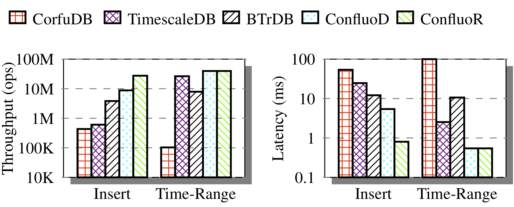

# Timeseries Database

We describe extensions to Confluo's interface to capture time-series data and
support operations similar to [BTrDB](http://btrdb.io) on the captured data.

## Implementation

Time-series data comprises of a stream of records, each of which is a 
(timestamp, value) pair. Confluo maintains an index on both the timestamp and
the value attribute on the Atomic MultiLog to support queries on time windows 
as well as more general diagnostic queries. Confluo also supports efficient 
aggregate queries on the captured time-series data, but via pre-defined 
aggregates and ad-hoc query execution.

Atomic MultiLog offsets implicitly form versions for the timeseries database — 
each offset corresponds to a new version of the database and includes all 
records before that offset. Confluo also permits users to compute the 
difference between two versions of the database: since database versions map 
to Atomic MultiLog offsets, Confluo fetches all records that lie between the 
offsets corresponding to the two versions.

## Compared Systems and Experimental Setup

We evaluate Confluo against [BTrDB](http://btrdb.io), 
[CorfuDB](https://github.com/CorfuDB/CorfuDB) and 
[TimescaleDB](https://www.timescale.com) on c4.8xlarge instances with 18 CPU 
cores and 60GB RAM. We used the [Open μPMU Dataset](http://powerdata.lbl.gov), 
a real- world trace of voltage, current and phase readings col- lected from 
LBNL’s power-grid over a 3-month period. We create a separate Atomic MultiLog
for each type of reading (voltage, current or phase). We run single server 
benchmarks with 500 million records to highlight the per-server performance of
these systems. Requests are issued as continuous streams with 8K record batches.

## Results

	

	<b>Figure:</b> <em>ConfluoD & ConfluoR measure performance for DURABLE & DURABLE_RELAXED 
	modes respectively. ConfluoD achieves 2-20x higher throughput, 2-10x lower
	latency for inserts, and 1.5-5x higher throughput, 5-20x lower latency for
	time-range queries than compared systems.</em>

The figure above shows that systems like CorfuDB and TimescaleDB achieve over 10x lower performance than BTrDB and Confluo. We emphasize that this is not a shortcoming: CorfuDB and TimescaleDB support stronger (transactional) semantics than BTrDB and Confluo. Thus, depending on desired semantics, either class of systems may be useful for an underlying application.

Confluo, using DURABLE_RELAXED writes, is able to achieve close to 27 million inserts/second due to its cheap versioning and lock-free concurrency control. For time-range queries, almost all systems observe similar throughput since queries are served via in-memory indexes. Insertion and query latency trends are similar to throughput trends across different systems.